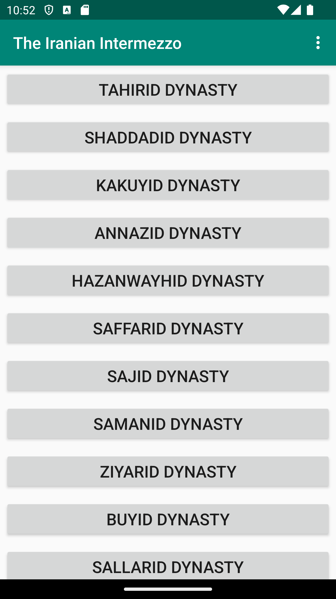
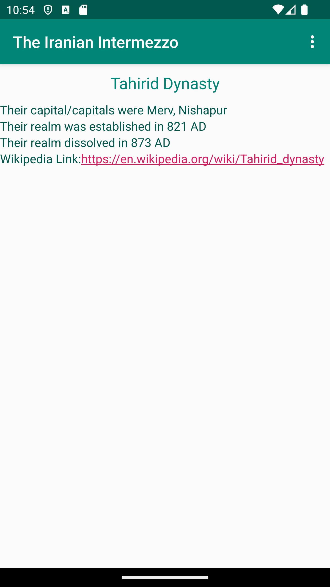
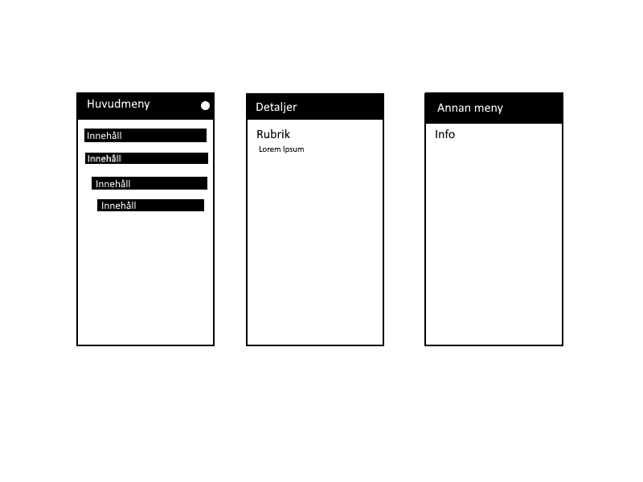

Webbtjänst - JSON

Figur 1 visar ett exempelobjekt från JSON-filen. Varje objekt beskriver en av de iranska dynastier som räknas till det Iranska Intermezzot
Namnet beskriver vilken dynasty objektet representerar, location anger vilka huvudstäder de nyttjade.
Size och cost nyttjas för att ange när de grundades respektive när de föll.
Auxdata inkluderar en wikipedia-länk till deras hemsida.

Fig.1

```
[{
	"ID": "a22zacno_1",
	"name": "Tahirid Dynasty",
	"type": "a22zacno",
	"company": "",
	"location": "Merv, Nishapur",
	"category": "",
	"size": 821,
	"cost": 873,
	"auxdata": "https://en.wikipedia.org/wiki/Tahirid_dynasty"
}
```

Implementation

Fig.2

```
    public void detailedInfo(Dynasty item){
        Intent i = new Intent(MainActivity.this, DetailActivity.class);
        //adds the data of the dynasty
        i.putExtra("name", item.getName());
        i.putExtra("capital", item.getCapital());
        i.putExtra("establish", item.getEstablish());
        i.putExtra("disestablish", item.getDisestablish());
        i.putExtra("wikipedia", item.getWikipedia());
        startActivity(i);
    }
```
Figur 2 är den kod som aktiverar detaljvyn för recycler objekten, och hämtar då information från json-objekten som sedan kan matas in. Den skapades först i samband med denna commit:
https://github.com/a22zacno/mobileapp-programming-project/commit/183d26214de6d1481fdb4143dbb7b101e73c84c8#diff-79e495c61f8bb7854647329a026c10e72759ba4043e41d8781fa61dfe8212ab8
Bild på recyclerlistan


Fig.3

```
        TextView nameView = findViewById(R.id.nameView);
        TextView capitalView = findViewById(R.id.capitalView);
        TextView establishView = findViewById(R.id.establishView);
        TextView disestablishView = findViewById(R.id.disestablishView);
        TextView wikiView = findViewById(R.id.wikiView);
        nameView.setText(name);
        capitalView.setText("Their capital/capitals were " + capital);
        establishView.setText("Their realm was established in " + establish + " AD");
        disestablishView.setText("Their realm dissolved in " + disestablish + " AD");
        wikiView.setText("Wikipedia Link:" + wikipedia);
        Linkify.addLinks(wikiView, Linkify.WEB_URLS);
```

Figur 3 visar den kod som ändrar widgeterna i detajvyn. Linkify set även till att göra texten i wikiview till en clickbar länk. Det implementerades i samband med denna commit:
https://github.com/a22zacno/mobileapp-programming-project/commit/abdbfe7e38275316628ffa438ce388e4ed0152e6
Bild på detaljvyn



Bild på skiss



Reflektion

Överlag var inte uppgiften så farlig, men det fanns förstås vissa delar som var lite mer besvärliga. Det tog en stund innan jag listade ut hur man på ett bra sätt kunde skapa en detaljvy för recyclerobjekten.
Jag gav också upp på att försöka nyttja en html fil för min about-page, delvis för att emulatorn krashade när jag försöktre ladda den men även för att jag inte är så bra på att skriva html-kod.

